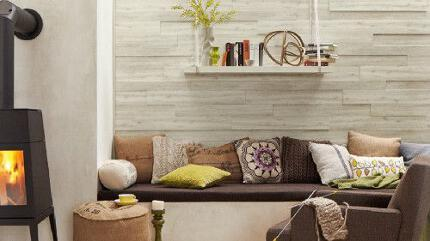

<!DOCTYPE html>
<html lang="de">
<head>
	<meta charset="UTF-8">
	<meta name="viewport" content="width=device-width, initial-scale=1.0, maximum-scale=1.0, user-scalable=no">
	<meta name="description" content="Böden, Türen, Decken, Fassaden, Holz im Garten, Bauholz und vieles mehr für die Region Würzburg, Estenfeld, Rimpar, Veitshöcheim, Kitzingen, Ochsenfurt, Marktheidenfeld, Schweinfurt, Karlstadt ."/>
	<meta name="keywords" content="Holz, Holzfachmarkt, Sägewerk, Holzhandlung, Würzburg, Estenfeld, Rimpar, Veitshöcheim, Kitzingen, Ochsenfurt, Marktheidenfeld, Schweinfurt, Karlstadt, Böden, Türen, Holz im Garten, Wände, Decken, Parkett, Laminat, WPC, BSH, Bauholz, Terrassen, Dielen"/>
	<meta name="author" content="Riga Ding Dong Song Productions"/>
	<!--<link rel="canonical" href="http://www.holzwelt-baier.de" -->
	
	
<title>Holzwelt Baier - Holzfachmarkt | Holzhandlung </title>  <!--Reitertext im Browser-->
	
	
<?php
	include "header.php";		/*header wird eingebunden*/
?>
				
<?php
	include "navi.php";			/*navigation wird eingebunden*/
?>				

<!-- Beginn des Slidesowbereichs für die großen Bilder auf Index-Seite -->

			
<!-- Slide 1 -->
	

		
		

			<h2>Willkommen bei Holzwelt Baier</h2> 
			<ul>
				<li> <h3>Holzwelt</h3></li>
  				<li> <h3>Holzfachmarkt</h3> </li>
  				<li> <h3>Holzhandlung</h3></li>
				<li> <h3>Messebau und Mustermodule</h3></li>
			</ul>
			<h3>Ihr Partner in Sachen Holz.</h3>
		

	

	
<!-- Slide 2 -->
	

		
		

			<h2>Willkommen bei Holzwelt Baier</h2> 
			<ul>
				<li> <h3>Holzwelt</h3></li>
  				<li> <h3>Holzfachmarkt</h3> </li>
  				<li> <h3>Holzhandlung</h3></li>
				<li> <h3>Messebau und Mustermodule</h3></li>
			</ul>
			<h3>Ihr Partner in Sachen Holz.</h3>
		

	

	
<!-- Slide 3 -->
	

		
		

			<h2>Willkommen bei Holzwelt Baier</h2> 
			<ul>
				<li> <h3>Holzwelt</h3></li>
  				<li> <h3>Holzfachmarkt</h3> </li>
  				<li> <h3>Holzhandlung</h3></li>
				<li> <h3>Messebau und Mustermodule</h3></li>
			</ul>
			<h3>Ihr Partner in Sachen Holz.</h3>
		

	
	
	
<!-- Slide 4 -->
	

		
		

			<h2>Willkommen bei Holzwelt Baier</h2> 
			<ul>
				<li> <h3>Holzwelt</h3></li>
  				<li> <h3>Holzfachmarkt</h3> </li>
  				<li> <h3>Holzhandlung</h3></li>
				<li> <h3>Messebau und Mustermodule</h3></li>
			</ul>
			<h3>Ihr Partner in Sachen Holz.</h3>
		

	

<!-- Slide 5 -->
	

		
		

			<h2>Willkommen bei Holzwelt Baier</h2> 
			<ul>
				<li> <h3>Holzwelt</h3></li>
  				<li> <h3>Holzfachmarkt</h3> </li>
  				<li> <h3>Holzhandlung</h3></li>
				<li> <h3>Messebau und Mustermodule</h3></li>
			</ul>
			<h3>Ihr Partner in Sachen Holz.</h3>
		

	
	
	
<!-- Slide 6 -->
	

		
		

			<h2>Willkommen bei Holzwelt Baier</h2> 
			<ul>
				<li> <h3>Holzwelt</h3></li>
  				<li> <h3>Holzfachmarkt</h3> </li>
  				<li> <h3>Holzhandlung</h3></li>
				<li> <h3>Messebau und Mustermodule</h3></li>
			</ul>
			<h3>Ihr Partner in Sachen Holz.</h3>
		

	
	
	
<!-- Slide 7 -->
	

		
		

			<h2>Willkommen bei Holzwelt Baier</h2> 
			<ul>
				<li> <h3>Holzwelt</h3></li>
  				<li> <h3>Holzfachmarkt</h3> </li>
  				<li> <h3>Holzhandlung</h3></li>
				<li> <h3>Messebau und Mustermodule</h3></li>
			</ul>
			<h3>Ihr Partner in Sachen Holz.</h3>
		

	
	
			
	
<!-- Ende des Slidesowbereichs für die großen Bilder auf Index-Seite -->				  

	

<main> 
		

<!-- Beginn des Bereichs PRODUKTE -->
	<article id=produkte>
		
		 <h1>Produkte</h1>

	
	
		 
			

			
			
			

				 <a href="boden.php">
				 
				 
						
				 		 
				 		 
				 		 

				 		 
Ob Parkett, Laminat, Kork, Dielen, Linoleum, Vinyl oder Design. Holzwelt Baier hat den passenden
				 		 Fußboden für Sie. 

				 		 

				 		 
				 		 

				 		 
				 		 
				 		  <h2>Böden</h2>
				 		 
				 		 

				
				</a>
		 		

		 		
		 		
		 		

				 <a href="tueren.php">
				 
				 
						
				 		 
				 		 
				 		 

				 		 
Hier finden Sie die passende Tür. Holzwelt Baier bietet eine große Auswahl an
				 		 Holztüren, Dekortüren, Lacktüren, Glastüren, Schiebetüren, Funktionstüren und vielem mehr. 

				 		 

				 		 
				 		 

				 		 
				 		 
				 		  <h2>Türen</h2>
				 		 
				 		 

				 		 
				
				</a>
		 		

		 		
		 		

				 <a href="wand.php">
				 
				 
						
				 		 
				 		 
				 		 
 
				 		 
Decken und Wände aus Holz oder WPC machen eine Fassade oder einen Raum gemütlicher. 
				 		 Holzwelt Baier hat eine große Auswahl an Paneelen, Fassadenelementen und Lichtelementen.

				 		 

				 		 
				 		 

				 		 
				 		 
				 		  <h2>Decken & Wände</h2>
				 		 
				 		 

				
				</a>
		 		

		 		
		 		
		 		
		 
				
				 

				 <a href="gartenholz.php">
				 
				 
						
				 		 
				 		 
				 		 

				 		 
Holzwelt Baier bietet Ihnen eine große Auswahl an Terrassen, Gartenhäusern, Überdachungen, Carports, Zäunen, Gartenmöbeln, Spielgeräten und vielem mehr.

				 		 

				 		 
				 		 

				 		 
				 		 
				 		  <h2>Holz im Garten</h2>
				 		 
				 		 

				
				</a>
		 		

		 		
		 		
		 			 

				 <a href="holzbau.php">
		 	
			 
						 
				 		 
				 		 

				 		 
Ob Bretter, Balken, Verschalung, Konstruktionsvollholz (KVH), Brettschichtholz (BSH) oder Platten. Holzwelt Baier hat das Richtige für Ihr Bauprojekt. 

				 		 

				 		 
				 		   

				 		 
				 		  <h2>Bauen mit Holz</h2>
				 		 
				 		 
			 
		 		
				 </a>
		 		

		 		
		 
		 
		 
		 
				 

				  <a href="verpackung.php">
				 								 
			 	
						
				 		 
				 		 
				 		 

				 		 
Bretter, Bohlen, Balken, Latten. Holzwelt Baier produziert Verpackungsholz für die Industrie. Natürlich
				 		 auch IPPC-behandelt. 

				 		 

				 	 
				 	 
				 	 	 

				 		 
				 		  <h2>Verpackungsholz</h2>
				 		 
				 		 

				 
					 </a>
		 			

		 		
		 		
		 		
		 			 

		 			  <a href="zubehoer.php">
				 								 
			 	
						
				 		 
				 		 
				 		 

				 		 
Holzwelt Baier hat das das passende Zubehör für Ihr Holzprojekt. Schrauben, Nägel, Befestigungen, Auflagen, Farben, Lackierungen, Pflegeprodukte und vieles mehr. 

				 		 

				 	 
				 	 
				 	 	 

				 		 
				 		  <h2>Zubehör</h2>
				 		 
				 		 

				  	</a>
		 			

		 			
		 			
		 			

		 			<a href="referenzen.php">
				 								 
			 	
						
				 		 
				 		 
				 		 

				 		 
Unsere Erfahrung ist Ihr Mehrwert. Die Familie Baier, hat in über 60 Jahren bereits unzählige
							aufregende Projekte rund ums Thema Holz realisiert. Hier finden Sie eine Auswahl unserer Referenzen. 

				 		 

				 	 
				 	 
				 	 	 

				 		 
				 		  <h2>Referenzen</h2>
				 		 
				 		 

				 	
				 	 </a>
		 			

		 		
		
		 		
		 		
		 		 

		 		 <a href="service.php">
		 	
			 
						 
				 		
						 

				 		 
Holzwelt Baier schreibt Service groß. Beratung vom Fachmann, maßgenaue Zuschnitte, Montage vor Ort und vieles mehr. Wir bieten Ihnen das Rundumpaket.
						 

				 		 

				 
				 		  

				 		 
				 		  	<h2>Unser Service</h2>
				 		 
				 		 

				 
				 </a>
		 		
		 		
		 
			 

			 
			 
</article>			 
			 
	 
			 
			 
 <!-- Beginn des Bereichs INFORMATIONEN -->
 
 <article id=information>
			
			 <h1>Informationen</h1>	 
		 
	 
			 
		
			 
			 
				 <article class=fart_a id=news>
				 
					 <h2>News</h2>
					 					 				 
					  
					 				 
					 <article>
					 
<i>01.01.2019</i>

					 <h3>Neue Homepage</h3>
					  
					 
Lange hat es gedauert, nun ist es endlich geschafft. Unsere neue Homepage ist online.
					  
					  
					 In neuem Design und auch für Tablets und Smartphones optimiert finden Sie hier alle Informationen
					 rund um die Holzwelt Baier.
					 

					 </article> 				
				 
				 </article>
				 
				 
				 <article class=fart_a>
				 
					 <h2>Unser Katalog</h2>
					  
					 
					 

				 </article>
				  	
			 	
			 	

			 	
			 		<h2>Hier finden Sie uns
			 	
			 		</h2>
			 		 
			 		
			 	
			 		<iframe src="https://www.google.com/maps/embed?pb=!1m18!1m12!1m3!1d34654.22069128584!2d9.974574605691304!3d49.791887507491865!2m3!1f0!2f0!3f0!3m2!1i1024!2i768!4f13.1!3m3!1m2!1s0x47a28e50dfe0a48d%3A0x305f6bf548ed7ad7!2sHolzwelt+Baier+GmbH+%26+Co.+KG!5e0!3m2!1sde!2sde!4v1515945204537"
			 				width="100%" 
			 				height="200px" 
			 				frameborder="0" 
			 				style="border:0" 
			 				allowfullscreen>
			 		</iframe>
			 		
			 		 
			 		 
			 	    <h3>Adresse:</h3>
			 	    
			 		

			 			Holzwelt Baier,
			 			Friedrich-Bergius-Ring 10,
			 			97076 Würzburg. 
			 			 
			 			Schnell zu erreichen aus dem Raum Würzburg, Estenfeld, Rimpar, Veitshöcheim, Kitzingen, Ochsenfurt, Marktheidenfeld, Schweinfurt und Karlstadt.
			 		

			 	
			 	

			 	
			 	
			 	
			 	 <article class=fart_a>
				 
					 <h2>Angebote</h2>
					  
					 
					
					
				  </article>
			 	
			 	
			 	
			 	<article class=fart_a>
			 	
			 		<h2>Öffnungszeiten</h2>
			 		 
			 		
			 		

			 		Montag - Freitag:  
			 		7:30 - 18:30 
			 		 
			 		Samstag:  
			 		09:00 - 14:00 Uhr
			 		

			 	
			 	
			 	</article>
			 	
			 	
			 	
			 	<article class=fart_a>
			 	
			 		<h2>Kontakt</h2>
			 		 
			 		
			 		

			 		Tel: 0931 27978-0 
			 		Fax: 0931 27978-20 
			 		 
			 		<a href="mailto:info@holzwelt-baier.de"> info@holzwelt-baier.de</a> 
			 		<a href="http://www.holzwelt-baier.de"> www.holzwelt-baier.de</a>
			 		

			 	
			 	
			 	</article>
			 	
			 	
			 	 <article class=fart_a>
				 
					 <h2>Sägewerk Baier im Landkreis Bad Kissingen</h2>
					  
					 
					 
					 
					
			 		 
			 		
Besuchen Sie auch gerne unser Sägewerk im Landkreis Bad Kissingen.

					  
					 
				</article>
			 
			 
			 

			 
		</article>
		
		<!-- Beginn des Bereichs WILLKOMMEN -->
 
		<article>
			
			 <h1>Willkommen bei Holzwelt Baier</h1>	
			  
			 

			 Vor mehr als 60 Jahren gründete Robert Baier im Jahr 1951 das Sägewerk Baier in Neuwirtshaus direkt an der B27, eingebettet zwischen Spessart und Rhön. Schon bald entwickelte sich das Sägewerk zu einem leistungsstarken Nahversorgungsbetrieb. Während der Nachkriegszeit war vor allem Bauholz gefragt. In den Folgejahren entwickelte sich neben dem Einschnitt von Bauholz der Holzhandel zu einem weiteren Standbein des Unternehmens. Verlässliche Handelsbeziehungen wurden geknüpft, die zum Teil bis heute andauern. Spätestens mit der Gründung des Holzfachmarkts Holzwelt Baier in Würzburg im Jahr 1995 rückte auch der Einzelhandel immer stärker in den unternehmerischen Fokus. Eine stetig wachsende Einzelhandelsausstellung wurde neben dem Betriegbsgelände des Sägewerks aufgebaut, in der wir unsere Kunden kompetent und sachlich beraten können.
			  
			  
			1995 wurde im Industriegebiet Würzburg Ost ein Holzfachmarkt, die Holzwelt Baier, neu gebaut und eröffnet. Heute verstehen wir uns als modernes Familienunternehmen und ersten Ansprechpartner in Sachen Holz für die Region Würzburg, Estenfeld, Rimpar, Veitshöcheim, Kitzingen, Ochsenfurt, Marktheidenfeld, Schweinfurt, Karlstadt. In unseren Ausstellungen möchten wir Privatkunden viele Anregungen und fachkundige Beratung zu allen Themen rund um den Innen- und Außenausbau von Haus und Garten bieten. Unsere große Lagerhaltung, die Schnittholz, Holzverbundwerkstoffe (KVH, BSH, etc.), Platten und vieles mehr umfasst, ermöglichen es uns, ein ebenso starker und verlässlicher Partner für Profikunden aus dem Handwerk und der holzverarbeitenden Industrie zu sein.     
			 
			 
			Egal welches Projekt rund ums Holz Sie angehen wollen. Bei uns finden Sie immer ein offenes Ohr und fachkundige und ergebnisorientierte Beratung. Wir freuen uns, Ihnen helfen zu können.
			 
			 
			Ihre Holzwelt Baier
			

			 
		</article>
			 
			 
			 
			 
			 

			

			
			
			
			
			
			 
<!-- Beginn des Bereichs MEDIA -->	
	 
		 	

		 	

		 			
		 			

		 			
<!-- Google+ Widget -->
						

		 			

		 			
		<!-- Skript zum asyncronen Laden des JAvascripts für Google+ Widget -->
				
				
<!-- Facebook Widget -->
				

					
<blockquote cite="https://www.facebook.com/saegewerkbaier" class="fb-xfbml-parse-ignore"><a href="https://www.facebook.com/saegewerkbaier">Sägewerk Baier</a></blockquote>

				

		 			
		 			
<!-- Volleyball Hammelburg -->
		 			
		 				

		 	
						<a href="http://www.volleyball-hammelburg.de" target="blank">
						
						
						Sägewerk Baier ist Goldpartner von 
						TV/DJK Hammelburg Volleyball
						
					 </a>
					 
					 
		 			

		 			
		 			
<!-- Back to top -->	 			
		 			
		 			

		 			
		 			<h2>
		 			<a href="#">
				
					
				
						nach&nbsp;oben&nbsp;
						
					
						
				
					</a>	
		 			</h2>
		 			

		 		
<!-- Ende des Media-Abschnitts mit Google+-Einbindung, Volleyball Hammelburg, etc -->		 		
		 	

	
		 </main>
		 
		 
<?php
	include "footer.php";	
?>	 
	
